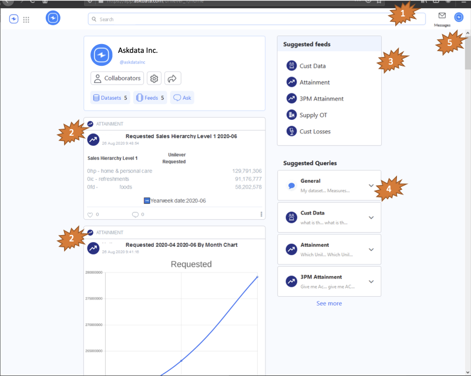

---
title: Your first usage
keywords: documentation
last_updated: October 15th, 2020
tags: [getting-started]
sidebar: mydoc_sidebar
layout: doc
--- 

## First Acess

### How to access askdata

You can start using Askdata using the link <https://app.askdata.com/> you can sign-in with your with your credentials or alternatively you can register your free Askdata account: <https://askdata.com/signup>

### The main features

The Application is composed by different features:

0. Home
1. Search bar
2. Data Cards
3. Feeds
4. Datasets
5. Ask

### Home

Home Feed will show the most recent data card along with the main information about the agent like the number of datasets and feeds. It’s also a good starting point to explore AI-driven curated feeds and queries.

### Search Bar (1)

Users can query the data at any time through the search bar. The Agent searches across all data to answer the questions. The cards provided by the Agent can be saved and shared as stated before.

In order to enable users to quickly find and select the information they need, when the user is typing the query system provides useful suggestions like most frequent queries similar to the ones the user is writing (drop-down menu) and the autocomplete of the query with the entities the system is aware.

### Data Cards (3)

Data Cards are the information units that the system provides to users. They can be generated on demand by asking, searched, or automatically generated by rules.

For each data card, users can Like (to enhance the ML/AI) add comments, share with other users through a message, publish through public feeds, save them in their personal feeds. (The options available depends on the security level of the dataset and the authorization level of the user)

**Read more:**
* [Data Card Expanded View](/docs/data-card-expanded-view)

### Feeds (3)

Feeds are containers of cards that are used to organize according to business logic chosen by the users themselves. Each user can create feeds and save cards in them. 
Users can create public or private feeds. Public feeds created by a user can be seen and followed by other users. Instead, private feeds are visible only to the user who created them.

Create a Feed
To create a new feed, from the Home:
click the “Feeds" button 
then click on "Create feed"
fill the form with the new feed Name, and select the associated Icon
choose the Visibility level (public or private) and the autofollow property

The autofollow property, if "yes" the new Feed is automatically followed from all the users, if "no" only the users that search for can follow it



